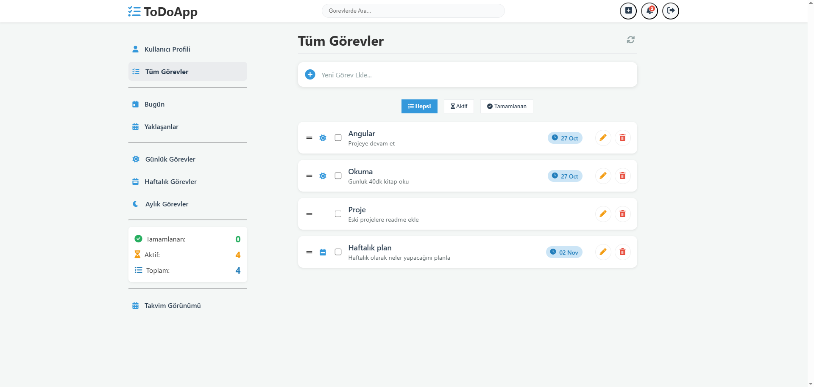
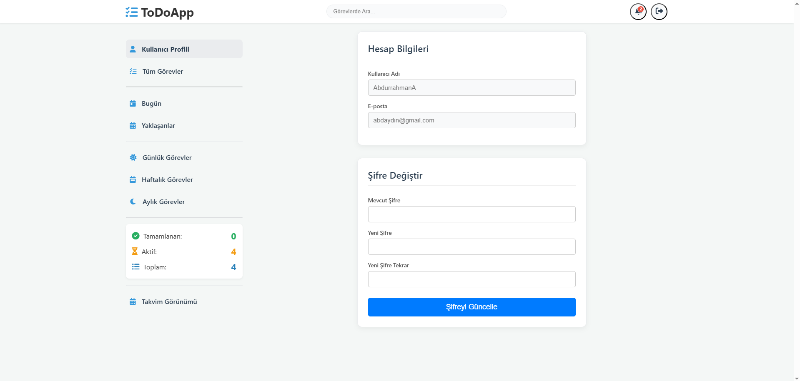
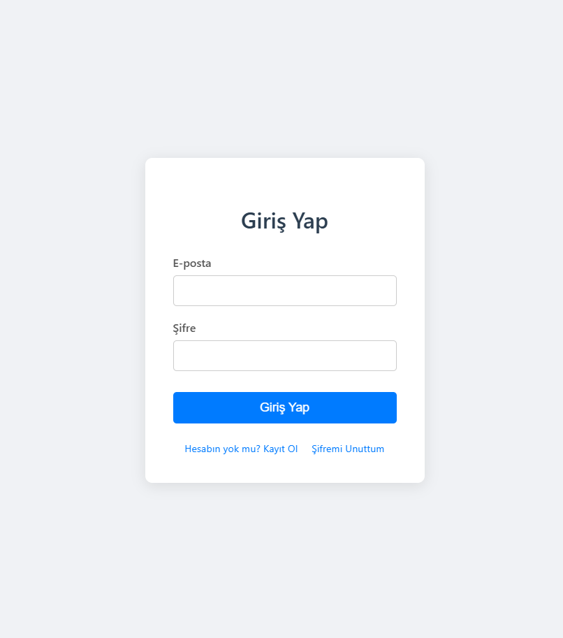
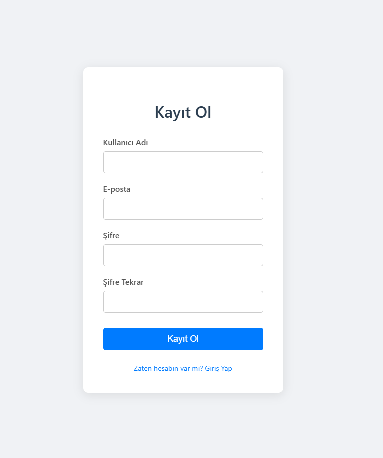

# ToDo List Uygulaması ( Angular + .NET Core )

<div style="display: flex; flex-wrap: wrap; justify-content: space-around; margin-bottom: 15px;">
  
  
  
  
</div>

Bu proje CQRS mimarisi kullanılarak geliştirilmiş bir ToDo projesidir.
Frontend **Angular** ,Backend **Asp .NET Core Web API** ile oluşturulmuştur

## 🚀 Temel Özellikler

* **Güvenli Kimlik Doğrulama:** JWT (JSON Web Token) tabanlı kullanıcı kaydı ve girişi.
* **Profil Yönetimi:** Kullanıcıların şifrelerini güvenli bir şekilde güncelleyebilmesi.
* **Görev Yönetimi (CRUD):** Görev (To-Do) ekleme, listeleme, güncelleme ve silme.
* **Asenkron ve Tekrarlayan Görevler:** **Hangfire** ile zamanlanmış görevlerin arka planda güvenilir bir şekilde yönetilmesi.
* **Backend-Driven Validasyon:** Tüm doğrulama kuralları (.NET Data Annotations) sunucu tarafında tanımlanır ve Angular'a yerelleştirilmiş (Türkçe) hata mesajları olarak gönderilir.
* **Güvenli Rotalar & Token Yönetimi:** Angular Route Guards ile yetkisiz erişim engellenir ve HTTP Interceptors ile her API isteğine JWT token'ı otomatik eklenir.

## Dosya Yapısı

Proje, backend ve frontend olarak iki ana bölümden oluşur:

```bash
AngularWithASP/
│
├─ ToDoApp.Server/
│ ├─ API/
│ │ ├─ Controllers/
│ │ ├─ Extensions/
│ │ └─ Program.cs
│ │
│ ├─ Application/
│ │ ├─ Commands/
│ │ ├─ DTOs/
│ │ ├─ Interfaces/
│ │ └─ Queries/
│ │
│ ├─ Domain/
│ │
│ ├─ Infrastructure/
│ │ ├─ Context/
│ │ ├─ Localization/
│ │ ├─ Migrations/
│ │ ├─ Repositories/
│ │ └─ Services/
│ │

│
├─ angularwithasp.client/
│ ├─ src/
│ │ ├─ app/
│ │ │ ├─ core/
│ │ │ │ ├─ guards/
│ │ │ │ └─ interceptors/
│ │ │ ├─ features/
│ │ │ │ ├─ auth/
│ │ │ │ ├─ calendar/
│ │ │ │ ├─ profile/
│ │ │ │ └─ todo/
│ │ │ ├─ shared/
│ │ │ └─ app-routing-module.ts
│
├─ README.md
└─ .gitignore
```
## 🗃️ Veritabanı Şeması

Proje, **Entity Framework Core (Code-First)** yaklaşımıyla geliştirilmiştir. Veritabanı şeması, `Domain` katmanındaki varlıklara (entities) dayanır ve `Infrastructure/Migrations` klasöründeki migration'lar ile oluşturulur.

### `ToDos` Tablosu
Uygulamanın ana görev tablosudur.

| Kolon Adı | Veri Tipi (MSSQL) | Açıklama |
| :--- | :--- | :--- |
| `Id` | `uniqueidentifier` (Guid) | Primary Key |
| `Title` | `NVARCHAR(100)` | Görev başlığı (Zorunlu) |
| `Description` | `NVARCHAR(500)` | Görev açıklaması (Opsiyonel) |
| `IsCompleted` | `BIT` | Görevin tamamlanma durumu (Zorunlu) |
| `CreatedAt` | `DATETIME2` | Görevin oluşturulma tarihi (Varsayılan: `GETDATE()`) |
| `DueDate` | `DATETIME2` | Görevin son teslim tarihi (Opsiyonel) |
| `RecurrenceRule` | `NVARCHAR(50)` | Tekrarlanma kuralı (daily, weekly, monthly) (Opsiyonel) |
| `ApplicationUserId` | `uniqueidentifier` (Guid) | Görev sahibi kullanıcı (`AspNetUsers` tablosuna Foreign Key) |

### `AspNetUsers` Tablosu
Kullanıcı bilgileri (`Id`, `Email`, `UserName`, `PasswordHash` vb.), **.NET Identity**'nin standart tablolarında güvenli bir şekilde saklanır.

## Kullanılan Teknolojiler

**Backend**
  - ASP.NET Core 8.0
  - Entity Framework Core
  - MSSQL Server
  - Swagger
  - MediatR
  - Data Annotations
  - Hangfire
  - JWTs

**Frontend**
  - Angular 17
  - Typescript
  - HTML + SCSS
  - RxJS
  - Angular Reactive Forms
  - Angular HTTPClient (Guards & Interceptors)


## Api Endpointleri

**GET /api/ToDo**  

`https://localhost:7261/api/ToDo`

 Giriş yapmış kullanıcının tüm görevlerini listeler.
 Response:

```bash

[
  {
    "id": "73aeb7ff-0497-48f3-a50d-c7ff115fb8bb",
    "title": "test",
    "description": "test",
    "isCompleted": false,
    "createdAt": "2025-10-27T13:25:21.0716255",
    "dueDate": "2025-10-28T00:00:00",
    "recurrenceRule": "weekly",
    "applicationUserId": "62fecc4a-80ac-4618-95ec-839f71b1fe49"
  }
]
```

    
**Post /api/ToDo**

`https://localhost:7261/api/ToDo`

Yeni bir görev oluşturur. 
Request Body:
```bash
{
  "description": "Test2",
  "title": "Test2",
  "dueDate": "2025-10-29",
  "recurrenceRule": "daily",
  "isCompleted": false
}
```
Response: (Oluşturulan görev döner)
```bash
{
  "id": "16dea880-3ef8-449f-92ee-796911f8b8b3",
  "title": "Test2",
  "description": "Test2",
  "isCompleted": false,
  "createdAt": "2025-10-27T13:27:31.2250885",
  "dueDate": "2025-10-29T00:00:00",
  "recurrenceRule": "daily",
  "applicationUserId": "62fecc4a-80ac-4618-95ec-839f71b1fe49"
}
```

**GET /api/ToDo/{id}**

`https://localhost:7261/api/ToDo/16dea880-3ef8-449f-92ee-796911f8b8b3`

Belirtilen ID'ye sahip görevi getirir.
Response:
```bash
{
  "id": "16dea880-3ef8-449f-92ee-796911f8b8b3",
  "title": "Test2",
  "description": "Test2",
  "isCompleted": false,
  "createdAt": "2025-10-27T13:27:31.2250885",
  "dueDate": "2025-10-29T00:00:00",
  "recurrenceRule": "daily",
  "applicationUserId": "62fecc4a-80ac-4618-95ec-839f71b1fe49",
  "applicationUser": null
}
```
**DELETE /api/ToDo/{id}**

`https://localhost:7261/api/ToDo/16dea880-3ef8-449f-92ee-796911f8b8b3`

Belirtilen ID'ye sahip görevi siler. Response: (Silinen görev döner)

```bash

{
  "id": "16dea880-3ef8-449f-92ee-796911f8b8b3",
  "title": "Test2",
  "description": "Test2",
  "isCompleted": false,
  "createdAt": "2025-10-27T13:27:31.2250885",
  "dueDate": "2025-10-29T00:00:00",
  "recurrenceRule": "daily",
  "applicationUserId": "62fecc4a-80ac-4618-95ec-839f71b1fe49",
  "applicationUser": null
}
```

**PUT /api/ToDo/{id}**

`https://localhost:7261/api/ToDo/73aeb7ff-0497-48f3-a50d-c7ff115fb8bb`


Belirtilen ID'ye sahip görevi günceller.
Request Body:
```bash
{
  "id": "73aeb7ff-0497-48f3-a50d-c7ff115fb8bb",
  "title": "string",
  "description": "string",
  "isCompleted": true,
  "createdAt": "2025-10-27T13:25:21.0716255",
  "dueDate": "2025-10-27T10:32:45.949Z",
  "recurrenceRule": "string",
  "applicationUserId": "62fecc4a-80ac-4618-95ec-839f71b1fe49",
  "applicationUser": null
}
```
## Projeyi Çalıştırma ve Setup Adımları

**Projeyi Çalıştırmak İçin Gerekli Önkoşullar**

- .NET SDK 8.0 veya uyumlu sürüm
- SQL Server	
- Node.js ve npm	
- Angular CLI
- smtp4dev

**Backend kurulumu**
1. Backend klasörüne gidin.
- ``` cd ../AngularWithASP/AngularWithASP.Server ```
2. Gerekli .NET paketlerini yükleyin:
- ``` dotnet restore```
3. Veribağlantısını ayarlamak için appsettings.json dosyasına kendi SQL server bilgilerinizi girin.
-
```bash
"ConnectionStrings": {
  "DefaultConnection": "Server=YOUR_SERVER;Database=ToDoDb;Trusted_Connection=True;"
}
```
4. Entity Framework Migrations ile veritabanını oluşturun.
- ``` dotnet tool install --global dotnet-ef ```
- ``` dotnet ef database update ```
5. API'yı çalıştırın.
- ``` dotnet run ``` 
6. Tarayıcı üzerinden Swagger, Hangfire ve smtp4dev arayüzlerine erişin.

- **Swagger (API Test):** `https://localhost:7261/swagger`
- **Hangfire Dashboard (Görev Takibi):** `https://localhost:7261/hangfire`
- **smtp4dev (E-posta Gelen Kutusu):** `http://localhost:5000` (veya smtp4dev'in size verdiği port)
  
**Frontend kurulumu**
1. Frontend klasörüne gidin.
- ``` cd ../AngularWithASP/angularwithasp.client ```
2. Angular paketlerini yükle.
- ``` npm install ```
3. Angular uygulamasını başlat
- ``` ng serve --open ```


